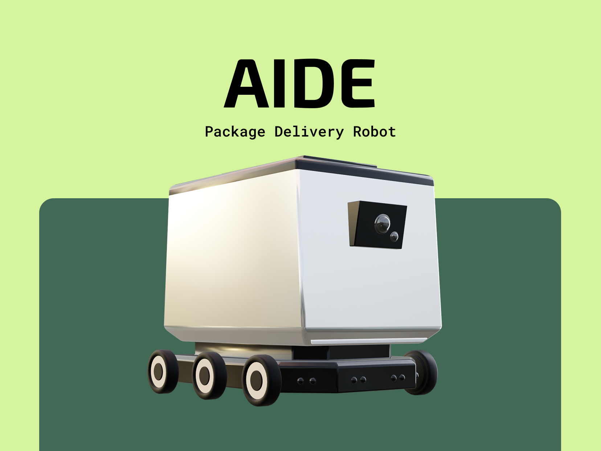
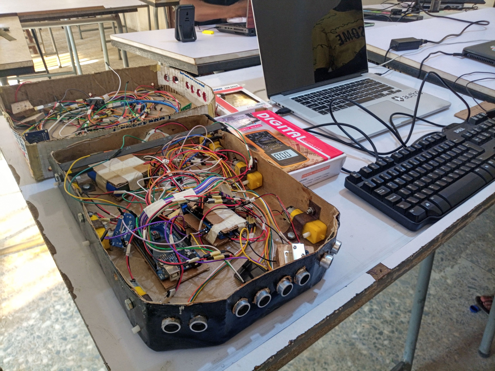
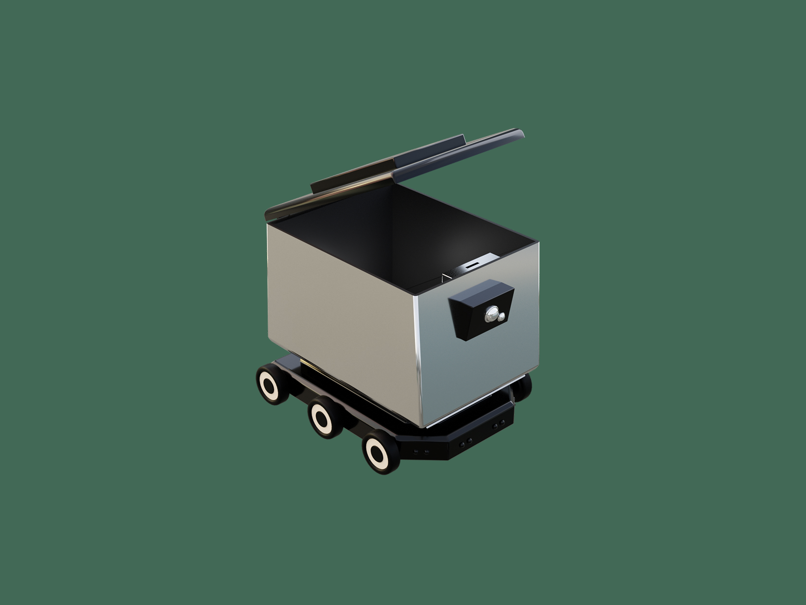
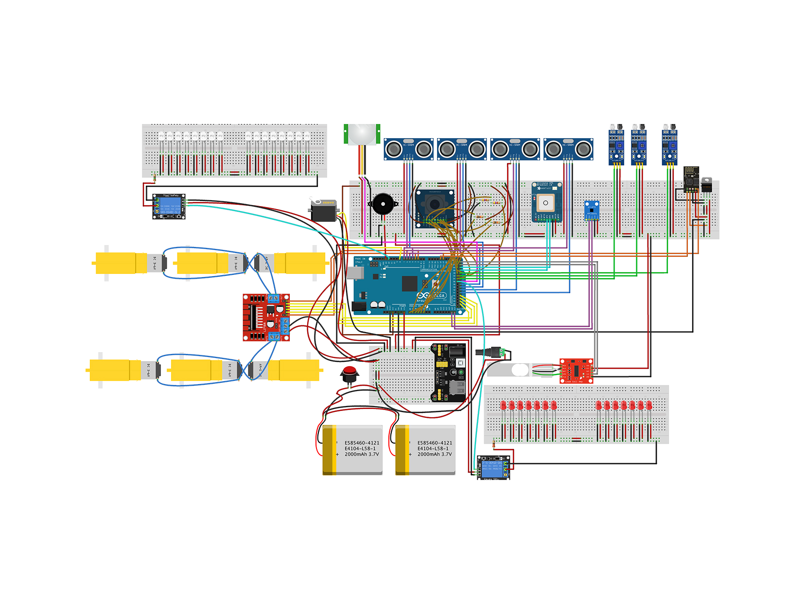
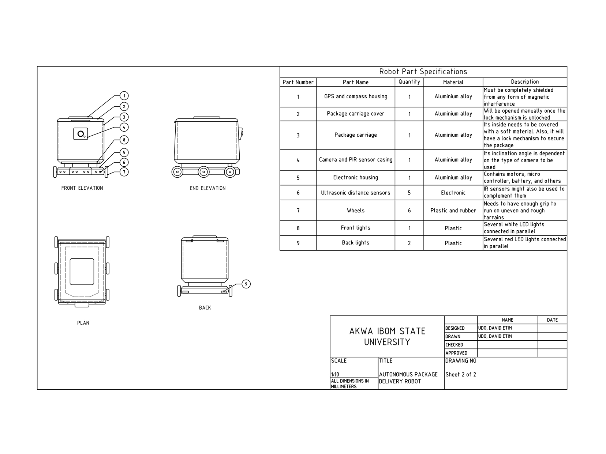

# AIDE

AIDE (Autonomous Interactive Delivery Entity) is a smart, web-controlled delivery robot designed for secure package transport and real-time interactive navigation.

## 🌟 Key Features

- **Web-Based Remote Control**: Real-time control interface for movement and monitoring.
- **Secure Delivery System**: Integrated solenoid door lock for cargo protection.
- **Smart Navigation**: Ultrasonic (sonar) sensors for obstacle detection and avoidance.
- **Interactive Feedback**: On-board buzzer for status alerts and motion signals.
- **Telemetry Dashboard**: Real-time feedback on robot status, including sensor data and connectivity.

## 📸 Gallery & Design

### 🏗️ Robot Assembly

_Progress view of the AIDE robot during final assembly._

### 🎨 Design Schematics

|                    3D Model (Top View)                    |                               Electronic Assembly                               |                                 Engineering Chassis                                  |
| :-------------------------------------------------------: | :-----------------------------------------------------------------------------: | :----------------------------------------------------------------------------------: |
|  |  |  |

## 🛠️ Technical Architecture

### Hardware Components

- **Microcontrollers**:
  - **Arduino Mega**: Handles motor control, sensors, and actuator logic.
  - **ESP32**: Manages high-speed WiFi connectivity and WebSocket communication.
- **Actuators**:
  - DC Motors (Managed via AFMotor driver).
  - Solenoid Door Lock for secure storage.
- **Sensors**:
  - 4x Ultrasonic Sonar Sensors for 360° obstacle awareness.
  - Infrared (IR) Sensor for proximity detection.
  - Passive Infrared (PIR) Sensor for motion tracking.
  - Buzzer for audible feedback.

### Software Stack

- **Firmware**: Written in C++ using the Arduino framework.
  - [Arduino Mega Firmware](firmware/mega.cpp): Core control logic.
  - [ESP32 Firmware](firmware/ep32.cpp): Connectivity layer.
- **Control Interface**: A modern web-based dashboard built with HTML5, CSS3, and JavaScript.
  - [Main Dashboard](control/index.html)
  - [Real-time Status Monitor](control/requests.html)

## 🚀 Getting Started

1. **Hardware Setup**: Assemble the robot based on the [Engineering Designs](images/engineering-design/).
2. **Firmware Upload**:
   - Flash `firmware/mega.cpp` to the Arduino Mega.
   - Flash `firmware/ep32.cpp` to the ESP32 (configure your WiFi credentials in the code).
3. **Launch Control Panel**: Open `control/index.html` in your browser to start controlling the AIDE robot.

---

_Created by David Udo_
